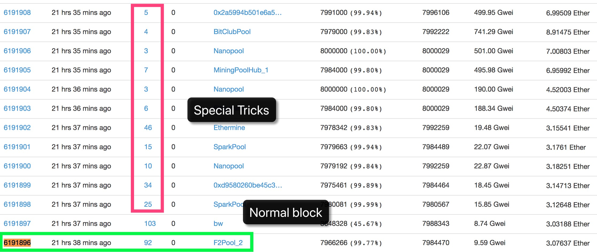
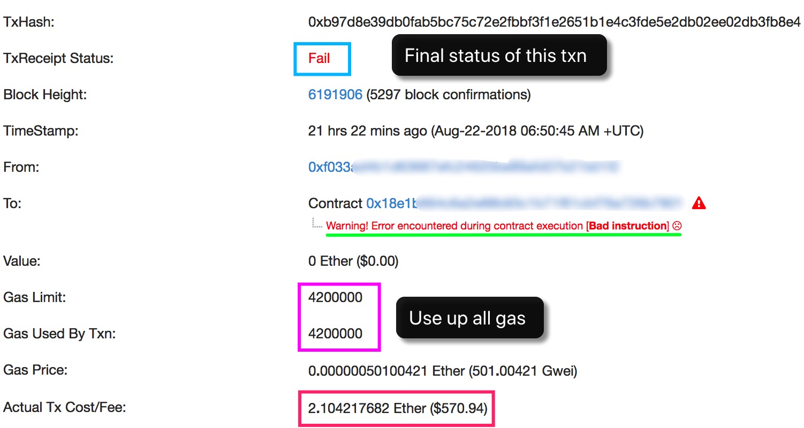
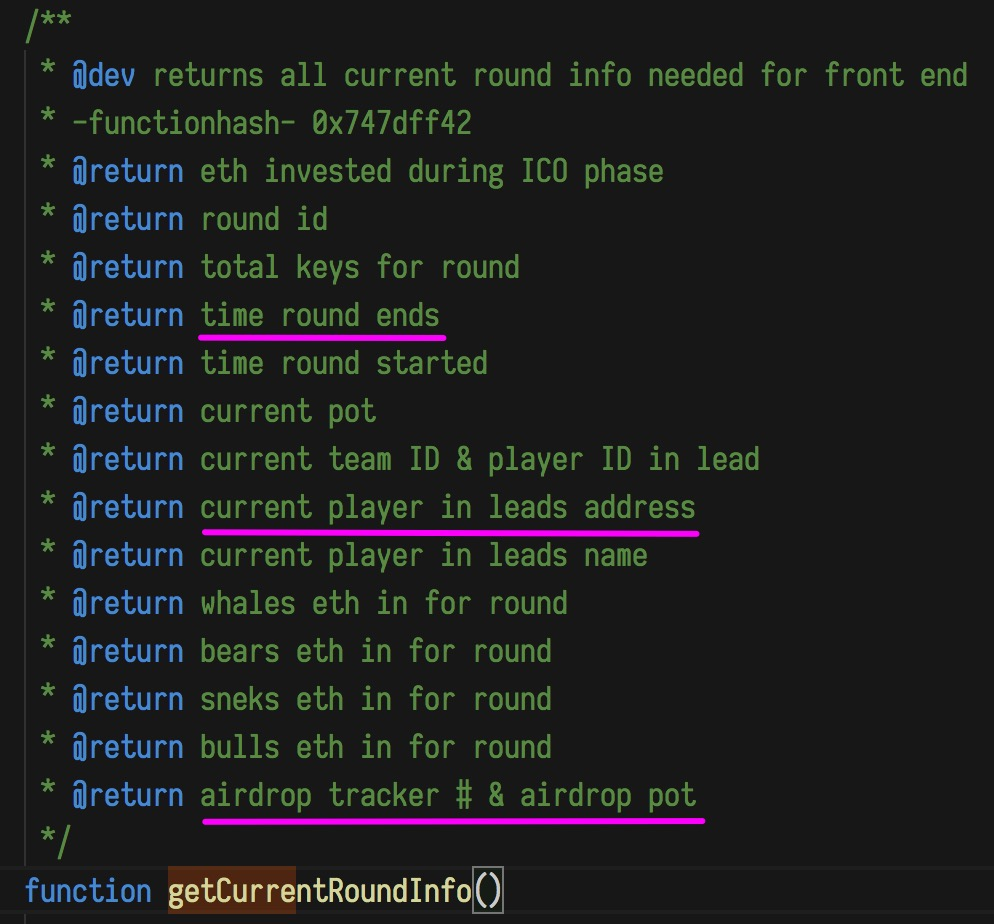

The first round of Fomo3D has ended and the winner's address is 0xa169, with a prize of 10,469.66 ethers.

You may think that the winner is just an ordinary participant.

SECBIT Labs **first found** that the Fomo3D winner played a special attack trick to sharply decrease the number of transactions packed by miners near the end of the game (multiple blocks were involved), **accelerating the approach of the game end** and **increasing the winning probability**. SECBIT Labs also observed several similar abnormal blocks and transactions regarding to the last round of Last Winner.

## A Series of Abnormal Blocks and Transactions

The picture shows that the block with height 6191896 packs the last key purchasing transaction of Fomo3D winner, containing 92 transactions which is normal.

However, the number of transactions in the following 11 blocks (6191898～6191908) **decreased sharply** and the minimum block (6191906) **only contained 3 transactions**, which is abnormal.

Take a look at these 'special' blocks.

Here we can see that the block with height 6191906 only had 3 transactions sending to the same contract (calling the same **mysterious contract**), and the sum of the transaction fees **is greater than 4 ethers**.

**The creator of this mysterious contract (0x18e1) is exactly the winner (0xa169)!**

The person in charge of F2POOL told us that a transaction with high TxFee would enter and get packed in blocks first.

This explains that the 11 blocks mentioned above possess excessive TxFee while they only pack few transactions. These blocks were processed by mining pools like SparkPool, Nanopool, Ethermine, BitClubPool, MiningPoolHub. Apparently, selecting transactions with high TxFee is in line with mining pools' interest and it is widely applied throughout the industry [1].

## What had the 'mysterious contract' ever done?

SECBIT Labs discovered that these abnormal transactions sent to the attack contract in related blocks all failed in the end.

We could see from the picture above that the final status is 'Fail' and Etherscan has a warning of `Bad instruction` and the Gas Limit (4200000) is exhausted, which is half of the normal gas limit, sending high TxFee to the mining pool which packed the transaction.

> Gas limit in Ethereum represents the maximum approved gas in a single block to determine the number of transactions packed in the block. Usually, the block gas limit is set with certain strategies between miners and the common value is 8000000 [2].
>
> Each transaction in Ethreum also has a gas limit set by the transaction sender, which is the maximum gas consumed by the transaction. The actual gas consumption is determined by the actual transaction execution process. The sum of all transaction gas cannot exceed the block gas limit [3].

We know that **assert() in Ethereum smart contracts is used for asserting. When the result of asserting does not satisfy conditions, the gas would be exhausted.** Etherscan would notify `Bad instruction` in case of this transaction, which is in fact caused by that the EVM encounters an undefined operator `0xfe` [4].

The winner (attacker) made use of this feature and took up the block gas limit with few transactions.

## More Brilliant Hacks

Moreover, SECBIT Labs discovered that the mysterious contract would call `getCurrentRoundInfo()` in Fomo3D to get info of the current round like the time remaining and the last buyer.

The 'mysterious contract' has not published its source code. By combining the result of reverse engineering, SECBIT Labs infers that the winner would call the method in the mysterious contract to query info, especially **time round ends** and **current player in leads address**. When the remaining time reaches a threshold and the last buyer is the attacker, call `assert()` to fail the transaction and use up all gas; when the remaining time is far from the threshold or the last buyer is someone else, do nothing, which takes little gas.

The winner (attacker) made use of this approach and launched many similar **mutable mysterious transactions**: when the attacker has a high winning change, use these mysterious transactions which would **get packed by mining pools first and take up the following blocks**, leading to the situation that other key purchases cannot be packed in time, accelerating the approach of game end and increasing the attackers' winning probability sharply.

## Other techniques and details

- SECBIT Labs observed that Fomo3D winner (attacker) created multiple similar mysterious contracts (attacking contracts) with transactions by different addresses to distract attention and decrease the chance of exposure. Each contract had many transactions and the one (0x18e1) making the attacker becoming the winner had more than 5000 transactions, which is of great efforts.
- When calling the mysterious contract (attacking contract), the winner (attacker) would try different gas limit from 170000 to 480000, which is a technique as well.
- More than 10 blocks after the block (6191896) containing the transactions of purchasing keys by  Fomo3D winner (attacker) 0xa169 has no transaction related to Fomo3D key buying, which ended the game finally.
- The next block (6191897) also contained many abnormal transactions.
- Before the game end, many of us assumed that attackers would cooperate with large mining pools for rejecting rivals' transactions to get the prize, or that attackers would launch lots of useless transactions to congest Ethereum network to get the prize, as rivals' transactions cannot be packed.
- The winner (attacker) made use of the common packing priority rather than **cooperated with mining pools**.
- The mysterious contract (attacking contract) is simply a classic model of turning smart contracts to weapons with great precision and definite objects. This attack is way more brilliant than tuning up the gas price to launch transactions with scripts near the game end. The attack transaction broadcast to each mining pool functioned like missiles in memory, watching for the proper moment for action.
- SECBIT Labs also observed multiple similar abnormal transactions and blocks at the end of Last Winner.
- The mysterious contract created by the winner (attacker) is trading with other Fomo3D-like games (e.g. Super Card) frequently, intending to get prizes with the same approach.
- There is simply no 'black swan', but only smart and diligent attackers. Please refer to 'Power Law Distribution' and 'Game Fallacy' [5].

## The Lucky F2POOL Mining Pool

Another point worth mentioning is that the winning transaction and the previous ones of two games (Fomo3D, Last Winner) were both packed by F2Pool.

After a detailed discussion, SECBIT Labs and F2POOL all primarily affirms that it is merely a coincidence. F2POOL is lucky enough to see the winning round of two popular smart contract games.

## The Future of Smart Contract Game

SECBIT Labs had reported attacks in Last Winner and other Fomo3d-like games that attackers made use of the airdrop bug in the original Fomo3D game to get much prize, along with vulnerabilities in Fomo3D Quick.

While we are sighing at the special winning techniques, we are worrying about the future of smart contract games.

As the most popular smart contract game in 2018, Fomo3D made many innovations in skills and laws, which is a great leap in smart contract game history. It is undeniable that the Fomo3D developing team has superior programming skills and strong feelings for decentralization.

When Fomo3D was published, many people said that it was a truly fair decentralized game. However, attackers were still able to make use of deficiencies and received great paybacks.

Limitations of skills, Greedy in humanity and information asymmetry all impede the birth of a truly secure, fair and transparent decentralized game. After Fomo3D, many copycats emerged without improvements in technologies and creativeness. The society is becoming more and more impetuous.

As a fan of blockchain and smart contract, SECBIT Labs is eager to embrace a secure, fair, outstanding and interesting smart contract game in the future.

## References

- [1] https://ethereum.stackexchange.com/questions/15896/do-mining-pool-or-miners-decide-on-which-transaction-to-be-included-in-the-next, 2017/05/06
- [2] Accounts, Transactions, Gas, and Block Gas Limits in Ethereum, https://hudsonjameson.com/2017-06-27-accounts-transactions-gas-ethereum/, 2017/06/27
- [3] Intro | Accounts, Transactions, Gas, and Block Gas Limits in Ethereum, https://ethfans.org/posts/479, 2017/07/03
- [4] Revert(), Assert(), and Require() in Solidity, https://medium.com/blockchannel/the-use-of-revert-assert-and-require-in-solidity-and-the-new-revert-opcode-in-the-evm-1a3a7990e06e, 2017/09/28
- [5] Black Swan, https://book.douban.com/subject/3025921/, 2008/05