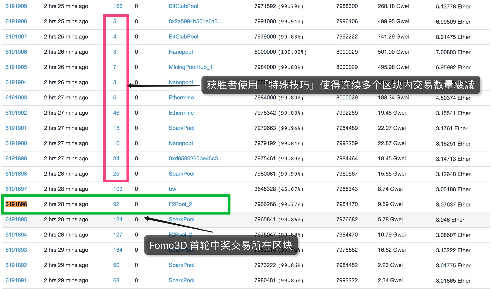
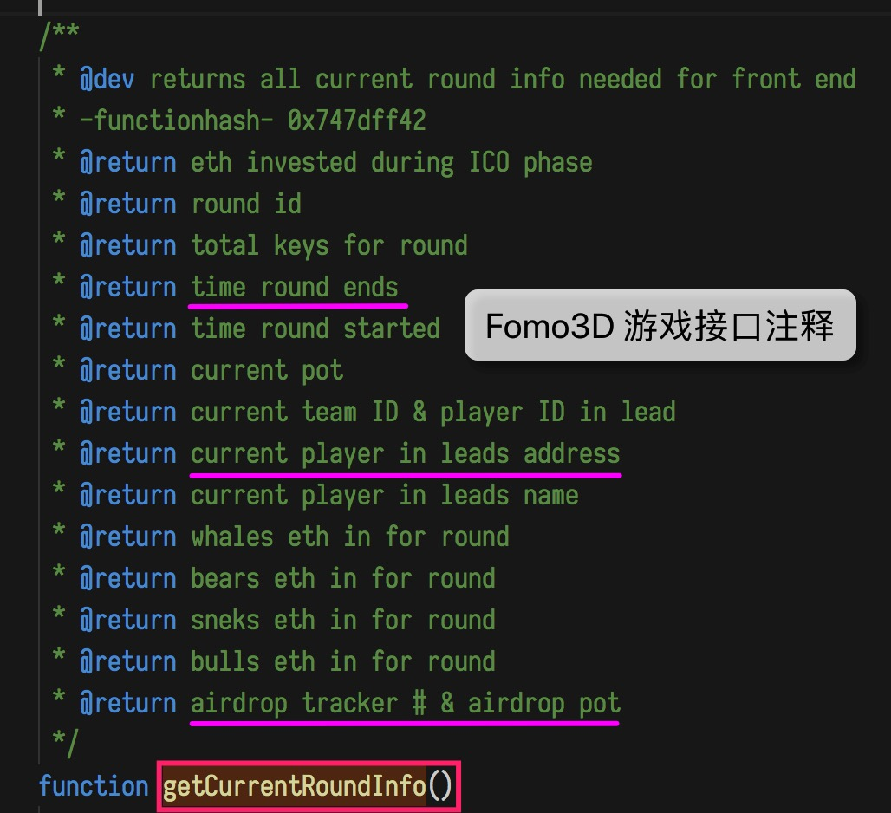

Fomo3D 游戏第一轮正式结束，最终大奖由地址 0xa169 获得，奖金额高达 10,469.66 以太币。

不少人轻易得出结论：获奖者平平无奇。

安比（SECBIT）实验室昨日**首个发现** Fomo3D 大奖获得者采取一些“特殊攻击技巧”，使得游戏临近结束时，矿工打包入区块内的交易数量骤减（涉及连续多个区块），从而起到**加速游戏结束**和**提高胜率**的作用。安比（SECBIT）实验室在 Last Winner 上轮游戏结束时也观察到了多个十分类似的异常区块和交易。

## 一组连续的异常区块和交易

如上图所示，高度为 6191896 的区块中打包了 Fomo3D 游戏中奖者最后购买 key 的交易，该区块共包含 92 笔交易，交易数量正常。

而在该区块后的连续 11 个区块（6191898～6191908），每个区块包含交易数量都**骤降**，最少的一个区块（6191906）**仅包含了 3 笔交易**，十分异常。

让我们来观察一下这些“特殊”的区块。

如上图所示，高度为 6191906 的区块仅包含了 3 笔交易，并且交易均发往同一合约（调用同一个**神秘合约**），三笔交易手续费之和**超过 4 个以太币**。

**而该神秘合约（0x18e1）创建者正是中奖者（0xa169）！**

通过向 F2POOL 负责人确认我们得知，矿池挑选交易进入区块的策略为手续费（TxFee）高的优先。

这也解释了为何上文提到的连续 11 个区块，都仅打包了很少量的交易，却能获得超出正常区块的手续费。这些区块分别由 SparkPool、Nanopool、Ethermine、BitClubPool、MiningPoolHub 等矿池打包，显然挑选高手续费交易优先打包，是符合矿池利益的策略，是行业通行的方案 [1]。

## 黑客的“神秘合约”究竟做了什么？

安比（SECBIT）实验室观察到，这些异常区块内发往神秘合约（攻击合约）的异常交易，最终状态均为失败。

如上图所示，交易最终状态为失败，并且 Etherscan 有 `Bad instruction` 错误提示，最终导致耗光 Gas Limit (4200000)，约为正常区块 Gas Limit 的一半，因此打包该交易的矿池也收到了高额的手续费。

> 以太坊区块 Gas Limit 这一概念，代表单个区块中最多允许的 Gas 总量上限，以此来决定单个区块中具体打包多少笔交易。区块 Gas Limit 由矿工间通过一定策略协商设定，目前区块常见值约为 8000000 [2]。

> 以太坊上每笔交易也包含一个 Gas Limit 概念，由交易发起者自行设定，代表该笔交易可最多消耗的 Gas 上限，实际 Gas 消耗以交易具体执行消耗为准。一个区块中所有交易花费的 Gas 不能超过区块的 Gas Limit [3]。

我们知道，**以太坊智能合约还存在一个指令 `assert()`，用于断言。当 assert 的结果不满足条件时，则会耗光交易的 Gas。** Etherscan 针对这种情况的交易通常提示 `Bad instruction`，实际则为 EVM 执行过程中遇到了一个未定义的操作符 `0xfe` [4]。

获奖者（黑客）就是利用这个特性，实现少量交易就能占用整个区块的 Gas Limit。

## 黑客更犀利的操作

进一步，安比（SECBIT）实验室发现神秘合约会调用 Fomo3D 游戏的 `getCurrentRoundInfo()` 接口，用于获取当前轮次比赛信息，如剩余时间、最后一位购买者的信息（最有可能获奖者）等奖池详尽信息（如下图）。

“神秘合约”并未公开源码，安比（SECBIT）实验室结合逆向结果推测，获奖者（黑客）通过神秘合约，在合约内调用该接口查询游戏信息，重点关注**剩余时间**和**最后一位购买者地址**。当游戏剩余时间达到一个阈值，并且最后一个购买者是自己时，则通过 `assert()` 让整个交易失败，并耗光所有 Gas；当剩余时间很长或最后一个购买者不是自己时，则不做任何操作，仅消耗很少的 Gas。

获奖者（黑客）就是利用这种方法，发起大量类似的**可变神秘交易**：在自己极有可能成为中奖者时，利用这些高额手续费的神秘交易，**吸引矿池优先打包，占满后续区块**，从而使得其他玩家购买 key 的交易无法被正常打包，最终加速游戏结束，并极大地提高自己的中奖概率。

## 其他一些技巧和重要细节

- 安比（SECBIT）实验室观察到 Fomo3D 获奖者（黑客）创建过多个类似神秘合约（攻击合约），并且前后曾使用很多不同地址向神秘合约发起交易，来分散大众注意力，降低自己的“特殊技巧”被发现的可能性。而每个攻击合约都有大量交易记录。上文提到的最终导致黑客获奖的攻击合约（0x18e1）有多达 5000 多笔交易，可见黑客暗地里做过不少尝试。
- 获奖者（黑客）控制的地址批量调用神秘合约（攻击合约）时，会给交易设置各种 Gas Limit，从 170000 到 4800000 不等，这同样是一个技巧。如果你猜出黑客的用意，欢迎添加小安同学微信（secbit_xiaoanbi）回答，她会把你加入到「SECBIT 智能合约安全技术讨论」的群里。
- Fomo3D 获奖者（黑客）0xa169 最后一次购买 key 后（区块 6191896），连续十余个区块，都无任何与购买 Fomo3D 游戏 key 相关的交易，这才最终导致游戏倒计时结束，获得最终大奖。
- 中奖区块的下一个区块（6191897），其实也包含大量异常交易，欢迎联系小安同学回答 :‑)。
- 在游戏结束前，大众一直假想黑客可能会与大矿池联合作弊，拒绝打包竞争者交易来获得大奖，或者设想黑客可能发出大量垃圾交易使以太坊网络拥堵而无法打包竞争者交易，从而获利。
- 这轮游戏的获奖者（黑客），**并未联合多家矿池作恶**，反而巧妙**利用了所有矿池优先挑选交易打包策略的共性**。
- 获奖者（黑客）部署的神秘合约（攻击合约），简直是智能合约作为攻击武器的典范示例，精确制导，有的放矢。比起盲目地使用自动脚本在临近游戏结束时调高 Gas Price 发起参与游戏交易，黑客的攻击手法显然高明许多 。广播至各矿池的攻击交易，如导弹一般部署在内存池中，根据游戏状况，伺机而动。 
- 安比（SECBIT）实验室在 Last Winner 上轮游戏结束时也观察到了许多十分类似的异常区块和交易，手法十分接近。
- 获奖者（黑客）创建的神秘合约，也正频繁与其他一些 Fomo3D 山寨游戏（如 Super Card）发生交易，企图使用同样的手法获得巨额大奖。
- 哪有什么简单的“黑天鹅”，有的只是聪明且努力的黑客。「幂律分布」和「游戏缪误」了解一下 [5]。  

## 幸运的 F2POOL 矿池

另外值得一提的是，两款游戏（Fomo3D、Last Winner）中奖交易最终均由 F2POOL 矿池打包出块，并且中奖者的上一笔参与游戏的交易，也均由 F2POOL 打包。

安比（SECBIT）实验室与 F2POOL 矿池负责人仔细讨论过相关细节后，均初步认为这是巧合。F2POOL 矿池幸运地见证了两款热门智能合约游戏两笔巨额中奖交易的诞生。

## 智能合约游戏路往何方

安比（SECBIT）实验室之前还报道过 Last Winner 及其他 Fomo3D 山寨游戏中，黑客利用原版 Fomo3D 游戏中的空投漏洞，攫取大量奖励，以及 Fomo3D Quick 版本存在的问题。

在感慨黑客利用特殊技巧获得高额回报之余，我们也不由地替各类智能合约游戏的未来产生担忧。

Fomo3D 作为 2018 年最火爆的智能合约游戏，在玩法和技术上做了很多创新，是智能合约游戏历史上重要的一步。不可否认，Fomo3D 开发团队，有着过人的技术水平和强烈的去中心化情怀。

Fomo3D 游戏刚出之初，不少人都惊呼，这是真正公平的去中心化游戏。但回到现实，依旧有黑客能发现当中的各类缺陷，并悄悄利用，获得可观的回报。

技术的局限性、人性的贪婪、信息的不对称，都制约着一款真正安全、公平、透明的去中心化游戏的诞生。在 Fomo3D 出现之后，各类山寨游戏纷纷涌现，却没有在技术和创新上能走得更远，圈子氛围变得浮躁且嘈杂。

作为区块链及智能合约爱好者，安比（SECBIT）实验室无比希望能尽快看到下一款安全、公平、优秀、有趣的智能合约游戏出现。

## 参考文献

- [1]: https://ethereum.stackexchange.com/questions/15896/do-mining-pool-or-miners-decide-on-which-transaction-to-be-included-in-the-next, 2017/05/06
- [2]: Accounts, Transactions, Gas, and Block Gas Limits in Ethereum, https://hudsonjameson.com/2017-06-27-accounts-transactions-gas-ethereum/, 2017/06/27
- [3]: 科普 | 以太坊中的账户、交易、Gas 和区块 Gas Limit, https://ethfans.org/posts/479, 2017/07/03
- [4]: Revert(), Assert(), and Require() in Solidity, https://medium.com/blockchannel/the-use-of-revert-assert-and-require-in-solidity-and-the-new-revert-opcode-in-the-evm-1a3a7990e06e, 2017/09/28
- [5]: 黑天鹅, https://book.douban.com/subject/3025921/, 2008/05

以上数据均由安比（SECBIT）实验室提供，合作交流请联系info@secbit.io。

------

**安比（SECBIT）实验室**

安比（SECBIT）实验室专注于区块链与智能合约安全问题，全方位监控智能合约安全漏洞、提供专业合约安全审计服务，在智能合约安全技术上开展全方位深入研究，致力于参与共建共识、可信、有序的区块链经济体。

安比（SECBIT）实验室创始人郭宇，中国科学技术大学博士、耶鲁大学访问学者、曾任中科大副教授。专注于形式化证明与系统软件研究领域十余年，具有丰富的金融安全产品研发经验，是国内早期关注并研究比特币与区块链技术的科研人员之一。研究专长：区块链技术、形式化验证、程序语言理论、操作系统内核、计算机病毒。

