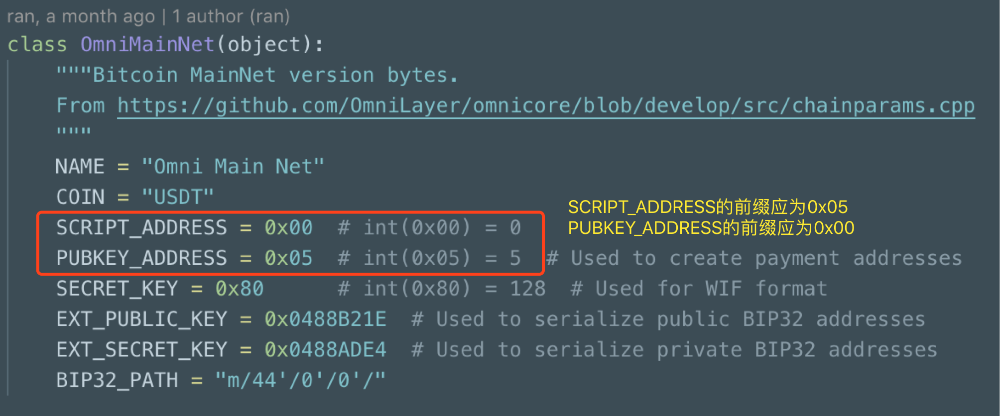

> 比特币地址有 1 打头地址 ，也有 3 打头的地址，你知道这两者有什么区别吗？
>
> 在哪种情况下，地址上的比特币会被锁死？
>
> 到底是谁拥有比特币的控制权，是你？还是你的钱包？

**如果你在使用比特币钱包，但却无法回答上面三个问题，那么这篇文章是为你而写。**

安比（SECBIT）实验室在对数字钱包源码审计时，发现一个名为 pywallet 的比特币钱包开源库包含了一个严重缺陷。如果向 pywallet 生成的 OmniLayer 收款地址转账，将导致资产永久丢失。

据安比（SECBIT）实验室区块链技术专家 zer0to0ne  解释，OmniLayer 协议允许在比特币区块链上发行自定义资产（比如 USDT）。OmniLayer 资产交易的本质是比特币交易。比特币交易的代码库有很多，pywallet 便是其中一种。它可以方便的构造符合 OmniLayer 格式的比特币交易。目前 pywallet 已经被应用在一些数字钱包软件中。

**但是，开源库 pywallet 在生成 OmniLayer 钱包地址的时候，误将地址的前缀写反了，若干资产被锁死在无效的地址内！**

下面是 pywallet 相关错误代码截图：



*文件地址：https://github.com/ranaroussi/pywallet/commit/eb784ea4dd62fe2a50e1352e7d24438fc66a4ac0#diff-ca3a8be6f2ab4be3bfd69a49f5f4122a*

插队科普一下：比特币网络上最常见的地址类型有三种：普通公钥地址（*1-地址*），脚本哈希地址（*3-地址*）和隔离见证地址（*bc1-地址*），地址类型通过地址的前缀来区分。其中*1-地址*的前缀为 0x00，*3-地址* 的前缀为 0x05。

* *1-地址*：这是最常见的比特币地址，通常用于普通转账收款。*1-地址* 实际上为公钥Hash的编码。验证 *1-地址*的签名后便可解锁收款。
* *3-地址*：这个地址为脚本（Script）哈希地址。这类地址实际对应为一段比特币脚本Hash的编码。
* *bc1-地址*：bech32编码地址，用于隔离见证交易。

开源库 pywallet 颠倒了地址前缀，将 *1-地址* 错误地设置为 *3-地址*。因此原本要转给 *1-地址* 的资产会误转入 *3-地址*。当账户持有者以 *1-地址* 的验证方式，也就是私钥签名去取出资产的时候，区块链网络却以 *3-地址* 执行脚本的方式去执行验证，导致用户无法正常取出资产！


*请慎重使用 pywallet 开源库！！*

#### 真相：比特币从未真正实现过转账功能 

这一点出乎很多人的意料，由于比特币的实现基于 UTXO 模型，与我们直观理解的账户模型不一样。zer0to0ne 解释说，**实际上比特币从未真正实现过通常意义上的转账功能**。中本聪只给比特币设计了一系列比特币脚本操作符和比特币脚本执行器，而所谓的转账过程实际是由一段比特币脚本锁定、解锁过程来模拟。这与日常生活中的账本概念（或称之为账户模型）不一样。

为了便于理解，我们可以把比特币区块链上的资产交易比喻成 **将资产锁进保险箱**，只有持有保险箱钥匙的人（即收款人）才能拿出保险箱中的资产进行交易。举个例子，如果 Alice 要向 Bob 支付一笔资产，Alice 将这笔资产锁进一个保险箱中，只有 Bob 才有这个保险箱的钥匙，即只有Bob才能取出这笔资产。如果 Bob 要取出资产，那么要求 Bob 必须同时花掉这笔资产（即锁入另一个保险箱）。在 Bob 没有取出资产前，资产并不真正属于 Bob。设想如果 Bob 丢了钥匙，那么将无法再取出资产。 换句话说，这笔资产还在保险箱中保存的时候，既不属于Alice，也不完全属于Bob。当然，Alice 也可以把资产放入任何人都可以打开的保险箱中，这也被称之为 Anyone-Can-Spend 交易。

由于比特币区块链上的收款地址不同，保险箱的类型也有所不同。**不同类型的保险箱需要不同类型的钥匙来开启。**付款人为收款人定制一个保险箱，将资产放入保险箱中并上锁，再将保险箱丢到公共场所。而保险箱有两种开启方法：

* 若收款人为 *1-地址*，我们称保险箱为*1-类保险箱* 。而相应的钥匙必须是指定收款地址对应的私钥。解锁保险箱的过程也就是验证 *1-地址*公钥以及公钥对应的数字签名，这也是我们通常所理解的向普通账户地址转账的验证过程。
* 若收款人为 *3-地址*，我们称为*3-类保险箱* 。开启钥匙必须为**一段可以执行的比特币脚本**。解锁保险箱的过程是：比特币脚本的Hash值对应到 *3-地址* ，同时比特币脚本执行器运行该脚本后**成功返回**。也就是说只有拥有脚本原文并可以成功执行的人才可以提取这个保险箱里的资产。

回到这一节的问题：为什么说比特币从未实现真正意义上的转账功能。答案很简单，因为比特币系统中根本就不存在账户的概念，账户之间的转账也无从谈起。一个人能在未来打开多少个保险箱，也是未知数。

通过上面的解释，我们可知：当 pywallet 开源库误将 *1-地址* 识别为 *3-地址* 时，就好像将原本的*1-类保险箱* 改造成了*3-类保险箱*，而账户持有者还是拿着 *1-类保险箱* 的钥匙去解锁，那么自然无法打开保险箱。那么之前 zer0to0ne 发现的被误锁住的 OmniLayer 数字资产是否能恢复？

#### 是否存在一种可能性，采用 *1-地址* 的钥匙去开启 *3-保险箱* ?

zer0to0ne 接着向我们详细解释了两个重要概念 P2PKH（Pay to Public Key Hash） 与 P2SH （Pay to Script Hash）的来龙去脉。这两个名词分别代表了两种不同的比特币交易类型。

下面是 zer0to0ne 的精彩技术细节分析

## P2PKH——中本聪的伟大发明

Pay to Public Key Hash 顾名思义，是将比特币放入一个保险箱，钥匙孔为公钥 Hash（Public Key Hash）。我们最常见到的 *1-地址* 本质上就是 Public Key Hash 的一种编码。*1-地址* 的生成过程也很简单，将公钥经过`Hash160`运算得到 Public Key Hash，在 Public Key Hash 头部补上前缀 0x00，Hash 尾部补上校验和，经过`Base58`便得到了1开头的比特币地址。

```
Base58(0x00 + <Public Key Hash> + Checksum)
```

我们来看看P2PKH交易类型的保险箱构造过程，Alice发送比特币给Bob为例：

付款方 Alice 在构造保险箱的时候需要设置一个**锁定脚本**：

```
OP_DUP 

OP_HASH160 

(Bob收款地址蕴含的Public Key Hash) 

OP_EQUALVERIFY 

OP_CHECKSIG

```

注：我们可以把这一步理解为 Alice 为 Bob 定制了一个保险箱，把比特币放入保险箱并用 Bob 的公钥 PubKey Hash上锁。现在这把锁除了持有私钥的 Bob，谁都无法打开。

当 Bob 需要花费 Alice 给他的比特币时，需要提供必要的参数：交易签名 + 公钥（技术黑话：scriptSig）来开启保险箱，使得锁定脚本执行后返回 True，这一步通常由钱包自动完成。

我们来看看比特币节点是如何校验 scriptSig 合法性的。


（图片来自Mastering Bitcoin）

脚本执行过程如图所示，Bob将交易签名后得到的数据（实际上还要包含数据长度信息），真正的scriptSig 应该为`<sig len> <sig> <pubKey len> <pubKey>`，比特币脚本执行器从 PUSH 数据开始，PUSH 操作会读取第一个字节获取将要入栈的数据长度信息，然后持续执行比特币脚本，直到最后执行完毕检查执行结果。

> 首先入栈的是 `<sig>`，然后将 `<PubK>` 入栈，一次DUP操作将在栈顶复制一份 `<PubK>`，HASH160弹出栈顶的<PubK> 并计算Hash，将结果压回栈中，之后使用 EQUALVERIFY 弹出Hash对比是否和 <PubKHash>相等，如果相等则返回True，不相等便标记交易为无效。执行到这一步，暴露了公钥，确保了签名者的身份的正确性，但是黑客或矿工可以通过暴露的公钥构造出一个新的交易替换原始交易，无法保证安全，那么便需要下一步来保证交易无法伪造。此时栈上还有 `<PubK>` 和 `<sig>`，执行 CHECKSIG，将校验数字签名的正确性，确保了签名者拥有地址对应的私钥。

数字签名除了持有私钥的人，谁也无法伪造，执行至此，一笔比特币P2PKH交易已经安全地完成了。

再解释一遍：当 Bob 要花费 Alice 给他的比特币时，Bob 只有用正确的钥匙才能打开 Alice 留给他的保险箱，把钱放入 Bob 新构造的一个保险箱里。

这时候一些聪明的读者会注意到**一个细节**：如果 Bob 取出钥匙，在还未打开保险箱的时刻，区块链上的任何矿工都能看得见这把钥匙的形状，理论上他们是可以立即复制一把钥匙，把 Alice 留给 Bob 的保险箱打开并花掉（俗称 Front-running 攻击）。真的可以这样做吗？**显然中本聪考虑了这个问题**，这把钥匙中的交易签名是 Bob 发起的交易的完整签名。假设 Bob 要将 Alice 构造的保险箱中的比特币 装入一个新的保险箱（留给Charlie），这时候 Bob 出示的钥匙包含了 Charlie 的公钥Hash，矿工虽然可以复制 Bob 的钥匙，但是这把钥匙已经隐藏了下一个新保险箱的关键信息，因此矿工无法使用这个复制钥匙来完成别的动作（无法挪用数字签名）。


## P2SH——后中本聪时代的重大创新

中本聪设计了一个这么强大的脚本系统，只用来构造转账交易似乎太浪费了，我们试试用其他指令构造一些特别的锁定脚本，并使用其他方式来解锁。

例如我们可以构造一个用 Hash 原象（Pre-image）来解锁交易的脚本：

```
OP_HASH160
<Hash>
OP_EQUAL
```

这个脚本的含义是：当满足 `Hash160(Pre-image)==<Hash>`这个条件时，便可成功将脚本解锁。

我们继续通过保险箱的例子来解释，并给这类保险箱起名为 *3-类保险箱*。现在 Alice 给 Bob 的比特币锁定在一个由上述 `Hash160`保护的保险箱里，我们姑且称之为哈希锁吧。

这把锁依然需要正确的形状才能开启，但是安全性却弱很多，缺少数字签名机制导致钥匙隐藏的关键信息不会随着Bob 新建的保险箱而变化。任何矿工都能在 Bob 亮出钥匙的一瞬间复制出一摸一样的钥匙，抢着去开Alice留给Bob的保险箱（Front-running），将币转给另一个人 Eve，于是原本属于 Bob 的比特币会被洗劫一空。

虽然这个脚本非常不安全，但是它却有两个非常神奇的功能：

1. 交易构造的输出足够短，意味着比特币节点维护的 UTXO 缓存占用空间将会大大减小

2. Pre-image 总是在交易被花费时作为 input 来引用，不会在交易的 output 侧出现，UTXO依然保持精简，同时可以把手续费负担转嫁给接收方。

既然所述的输出脚本好处很多，那我们是否有办法让这种交易方式变得安全呢？这就需要讲讲什么是 **P2SH**了。

比特币核心开发者 Gavin Adresen 提出了一种叫做 Pay to Script Hash (P2SH) 的技术。

P2SH 的交易输出依然是判断 `Hash160(Script)==<Script Hash>`，这里Script 就是上文中提到的 Pre-image 但是在判断完毕后又增加了一个步骤：使用比特币脚本执行器再次运行 Script 本身。

比特币开发者为这类交易创建了特殊的地址，用 3 作为开头（0x05经过 Base58 编码后变为 3），地址生成规则为:

```
Base58(0x05 + <Script Hash> + Checksum)
```

这样事情就变得有趣了，在前 P2SH 时代 Script 仅仅作为 Hash160 的原象存在，但是一旦激活了P2SH，Script 必须要求是一段有意义、可执行的比特币脚本。

我们可以在 Script 中加入数字签名检查的指令，或者多重签名检查功能，甚至智能合约都可以在P2SH的基础上进行开发，既使用了强大的比特币脚本，又能让交易保持精简。**并且由于 P2SH 交易地址中只存有 Script Hash，相当于保险箱上只有 Hash。**在交易被成功花费之前，任何人都无法知晓 Script 内容，很好的保护了隐私。

**P2SH在2012年4月1日激活，开启了比特币的P2SH时代**

现在全世界的 *3-类保险箱* 经过了升级，再也不怕钥匙被复制了，因为保险箱的钥匙会内置芯片。升级后的保险箱除了能够校验钥匙形状，更能读取钥匙中内置的芯片的数据，芯片中的内容会影响钥匙的形状。Bob制作了一个能够校验钥匙芯片中数字签名的保险箱，让Alice把钱放进这个保险箱然后锁起来。Bob开启保险箱的钥匙形状虽然可以被复制，但是这把钥匙内置了芯片，芯片中可以包含各种高级约束条件，保证钥匙不会被越权滥用。保险箱会在校验完形状后，会执行钥匙芯片内的程序查有效性，只有两个检查都通过才能开启保险箱。


## 被锁死的币是否有挽回可能

再回到开头的那个问题，zer0to0ne 遇到的钱包错误锁死资产的事故，能否采用 *1-地址* 的钥匙去开启 *3-保险箱* ，挽救保险箱中的资产呢?

这个问题可以解释为：Alice 按照 Bob 的要求制作了一个 *3-类保险箱*，但是这个保险箱是被 pywallet 错误修改的，实际上 Bob 的本意是需要一个 *1-类保险箱* ，因为 Bob 手里只有一个*1-类保险箱* 的钥匙。

当 Bob 请求 Alice 把比特币锁定到 *3-类保险箱* 时，这个保险箱就需要同时校验钥匙形状和钥匙芯片内容了，但是 Bob 的*1-类保险箱* 的钥匙形状是 Public Key 决定的，在保险箱误变为 *3-类保险箱* 后，钥匙形状校验却没有改变，也没有相应的钥匙芯片内容。

Bob 尝试在钥匙芯片中写入Public Key，使得钥匙形状和锁匹配，但是芯片中的Public Key 却无法被保险箱正确执行，所以 Bob 可能再也无法将他的比特币从保险箱中解锁了。


## SegWit——全新时代来临

比特币开核心发者 Eric Lombrozo, Johnson Lau, Pieter Wuille 提出来了一种全新的概念，隔离见证（Segregated Witness，简称SegWit）。这是一种有效缓解比特币区块拥堵的技术，并且彻底解决了交易延展性问题（Transaction Malleability）。

在SegWit升级之前，每一个用完的钥匙都插在保险箱上，钥匙占据了一定的体积导致仓库无法密集堆积这些用完的保险箱，总是要为了露在外面一大截的钥匙腾空间。那我们想想能不能把钥匙体积减小，并且用足够廉价的材料来制作，节约成本。

于是便有了隔离见证（Segregated Witness简称SegWit），它干脆直接把锁从保险箱上移走，变成一个远程无线校验的保险箱，用户可以把钥匙统一插在远离保险箱的地方来远程开启对应的保险箱。

**2017年08月24日，SegWit软分叉被正式激活，结束了旷日持久的矿工开发者对峙**

为了兼容3-类保险箱，比特币开发者使用了一种叫做P2SH-P2WPKH的技术，即通过P2SH来包裹P2WPKH交易，让P2WPKH交易可以骗过不支持SegWit的老旧节点。还有一种类似P2SH包裹的P2WSH技术（P2SH-P2WSH），在此不多做介绍。

我们先来解释一下P2WPKH是什么：

 P2WPKH全称Pay to Witness Public Key Hash，相较于P2PKH，P2WPKH把scriptSig移动到交易外部，节省了占用的区块空间。

为了向前兼容未及时升级的比特币节点，这个P2SH需要如何构造呢？

Bob首先产生一个P2PKH地址，从地址中解析出PubKey Hash，然后构造一个这样的脚本：

 `Script = 0x0014 + <Pubkey Hash>`

然后计算Script的Hash160得到Script Hash，构造出一个3地址：

```
Base58(0x05 + <Script Hash> + Checksum)
```

当 Alice 把币锁定到 Bob 提供的  `<Script Hash>`  中，意味着 Bob 需要提供正确的 Script 才能解锁。

Bob通过构造有效的Script通过了Hash160检查，即成功的通过了钥匙形状检查，并且钥匙里的程序也能被保险箱正确解析并执行。

细心的读者应该又发现了问题，这个钥匙却少了相关安全性约束，很容易被复制，（Front-running）矿工有机会将交易篡改，把币转给 Eve。

但是升级了 SegWit 之后，支持 SegWit 的比特币节点会在校验 P2SH 后再额外地校验Bob的签名是否正确，数字签名作为独立于交易之外的安全约束，不再占用宝贵的区块空间。

zer0to0ne：

> SegWit 为比特币扩容做出了贡献的同时，也同时在保持向前兼容性上面付出了一些代价。在原生 SegWit 交易被广泛采用之前，使用了混乱的 P2SH 兼容技术。如果未来比特币全部统一到 *bc1-地址* ，那么就可以彻底避免使用 P2SH 包裹技术，并且最大限度地利用区块容量。

## 对三个问题的回复

> 比特币地址有 1 打头地址 ，也有 3 打头的地址，你知道这两者有什么区别吗？

*1-地址* 是用做 P2PKH 交易的目标地址，而 *3-地址* 是用作 P2SH，SegWit交易的目标地址。

> 在哪种情况下，地址上的比特币会被锁死？

假设一个比特币地址为  *3-地址* ，如果世界上没有人能够提供一个可以通过Hash160校验并有效可执行的脚本，那么这个地址上的比特币会被锁死。

>  到底是谁拥有比特币的控制权，是你？还是你在使用的钱包？

如果一个比特币地址为 *1-地址* ，那么该地址上的比特币被锁在一个 *1-类保险箱* 中，拥有私钥的用户拥有该地址上的比特币。这里请注意“拥有私钥”有两层含义：（1）自己牢记私钥，（2）其他人无从知晓。

如果一个比特币地址为 *3-地址* ，那么在某个用户披露一个“解锁脚本”之前，没人知道该地址上的比特币归属。因为脚本由钱包来生成的，而用户只“拥有私钥”，如果你不知道地址对应的脚本，就相当于交出了地址控制权。脚本的内容才真正决定了比特币的归属。

