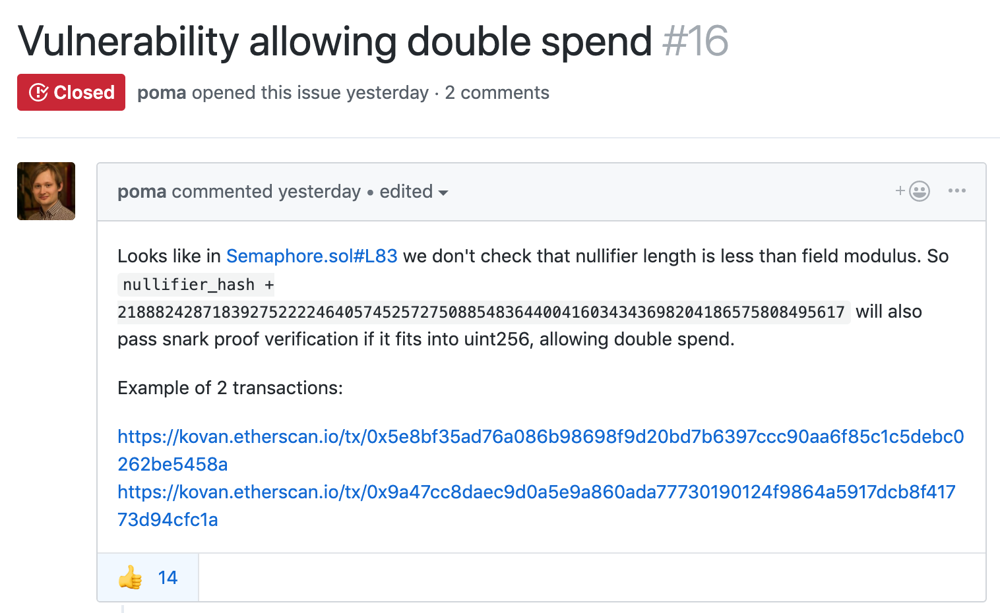
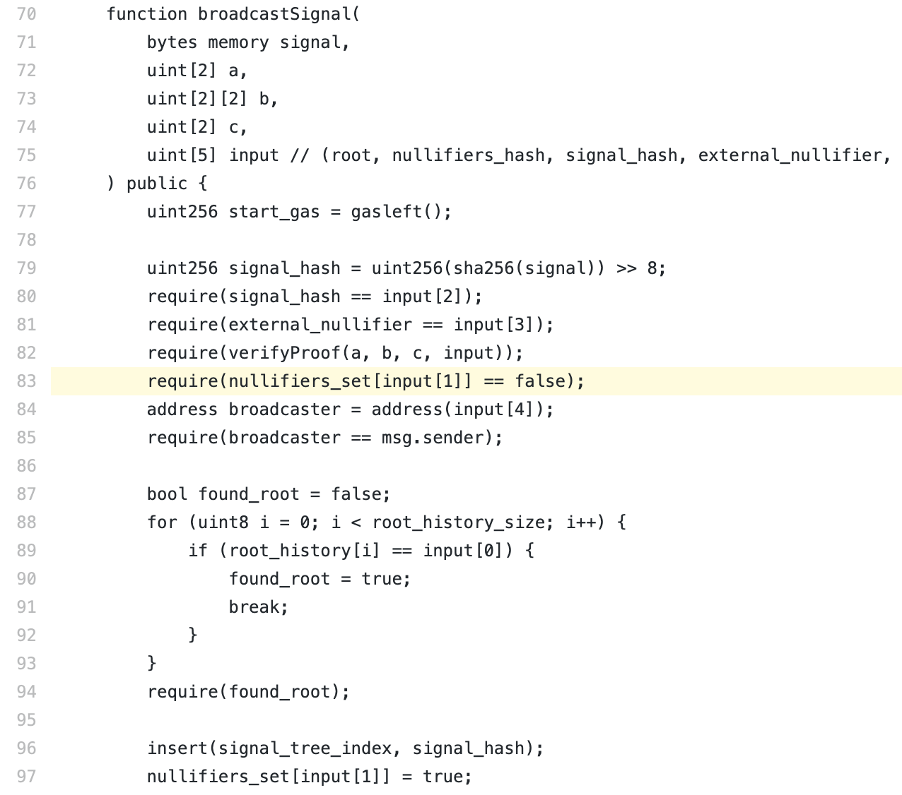
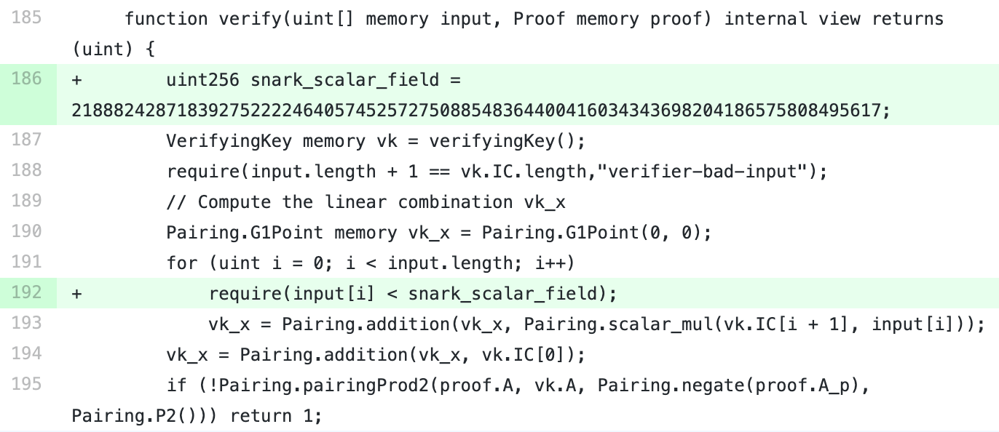

Many zero-knowledge proof projects are threatened by attacks like faking proof, double spending and replaying due to the 'Input Aliasing' bug caused by a contract library of zkSNARKs. This applies to many Ethereum open-source projects as well, including 3 most popular zkSNARKs library - snarkjs, ethsnarks, ZoKrates and 3 topical mixcoin apps - hopper, Heiswap, Miximus.

## Double Spending: The Very First Issue

Semaphore is an anonymous signal system with zero-knowledge proof evolved from the mixcoin project by the famous developer 'barryWhiteHat' .

Russian developer 'poma' first pointed out that [it might contain double spending bug](https://github.com/kobigurk/semaphore/issues/16)[1].



The bug hides in [line 83](https://github.com/kobigurk/semaphore/blob/602dd57abb43e48f490e92d7091695d717a63915/semaphorejs/contracts/Semaphore.sol#L83)[2] so please take a closer look:



This function requires the caller to constract a zero- knowledge proof to show he or she could take out money from the contract. Also, it reads `nullifiers_set` and check if a certain element of the proof is marked to prevent double spending. If the proof is in `nullifiers_set`, the contract would fail the check and the caller could not take money away. The developer suggests that people could not submit the same proof repeatedly for profit and this measure could prevent double spending and replaying.

However, one essential problem is missed. The attacker could pass the zero-knowledge check in line 82 and bypass the double-spending check in line 83 by modifying a former successful proof with the 'Input Aliasing' bug.

This bug could be dated back to 2017 when Christian Reitwiessner, the creator of Solidity, provided a [sample implementation](https://gist.github.com/chriseth/f9be9d9391efc5beb9704255a8e2989d)[3] of zkSNARKs contract cryptography. **Later on, almost every ethereum contract with zkSNARKs referred to this implementation, thus they could all get attacked by this technique.**


## Mixcoin APP: The Worst-hit Region

The earliest and widest application of zero-knowledge proof in ethereum is mixcoin or anonymous transferring/private transaction. The ethereum itself does not support anonymous trading, while the community is craving for privacy protection. Therefore, many hot projects emerged as a result. Here we use mixcoin contract application as an example to show you the threat of 'Input Aliasing' bug.

There are 2 preconditions of mixcoin contracts or anonymous transferring:

1. Prove that I have a certain number of money
2. Prove that the certain money is not spent

This is an explanation of the process for easier understanding:

1. A would like to spend some money.
2. A needs to prove ownership of this money. First, A shows a zkproof to prove that A knows the preimage of a hash (HashA), this hash is on the leaf of a tree with signal root, and the other hash of the preimage is HashB. HashA is the witness and HashB is the public statement. A is anonymous for not exposing HashA.
3. The contract checks zkproof and checks if HashB is in `nullifiers_set`. If not, the money is not spent yet and could be used by A.
4. If permission is given, the contract would put HashB into `nullifiers_set` to show that money of HashB is already spent.

The code `verifyProof(a, b, c, input)` in line 82 above shows the legitimacy of the money. `input[]` is the public statement. `require(nullifiers_set[input[1]] == false)` in line 83 checks if the money is spent before.

**Many zkSNARKs contracts, especially those involving mixcoin, have the same core logic of line 82 and 83. Therefore, they all have the same bug and might get attacked by 'Input Aliasing'.**

## Analysis: How to Spend The Money 5 Times Anonymously?

The function `verifyProof(a, b, c, input)` computes input parameters on the elliptic curve and applies a function called `scalar_mul()` to [implement scalar multiplication on the elliptic curve](https://github.com/iden3/snarkjs/blob/0349d90824bd25688e3013ca26f7f73b51bc7755/templates/verifier_groth.sol#L202)[4].

```js
    /// @return the product of a point on G1 and a scalar, i.e.
    /// p == p.scalar_mul(1) and p.add(p) == p.scalar_mul(2) for all points p.
    function scalar_mul(G1Point point, uint s) internal returns (G1Point r) {
        uint[3] memory input;
        input[0] = p.X;
        input[1] = p.Y;
        input[2] = s;
        bool success;
        assembly {
            success := call(sub(gas, 2000), 7, 0, input, 0x80, r, 0x60)
            // Use "invalid" to make gas estimation work
            switch success case 0 { invalid() }
        }
        require (success);
    }
```

We know that ethereum has some pre-compiled contract embedded for cryptographic computation on the elliptic curve to reduce the gas consumption of zkSNARKs verification. The implementation of `scalar_mul()` calls the No. 7 pre-compiled ethereum contract and realizes scalar multiplication[5] of elliptic curve alt_bn128 according to [EIP 196](https://github.com/ethereum/EIPs/blob/master/EIPS/eip-196.md). The following graph is the definition in the yellow book, which we usually call ECMUL or ecc_mul.


In cryptography, the range of elliptic curve `{x,y}` is a finite field based on mod p called Zp or Fp. In another word, the x and y from coordinate `{x,y}` of the elliptic curve are values in Fp. Some points from an elliptic curve form a relatively huge cyclic group and the sum of the points are called the order, `q`, of the group. The encryption based on the elliptic curve is performed within this cyclic group. If the cyclic group order `q` is a prime number, then the encryption could get performed in a mod q finite field `Fq`.

Usually, we pick big cyclic groups as the base of encryption. Select a random non-infinite point of the cyclic group as the generator `G` (The group order `q` is usually a huge prime number, then picking any non-zero point is equival), and all other points could get generated by `G+G+....`. The number of elements in this group is `q` meaning that there are `q` points, and we could mark every point by `0,1,2,3,....q-1`. Here the point 0 is an infinite point, point 1 is `G` mentioned before - it is also called the base point, point 2 is `G+G` and point 3 is `G+G+G`.

Now we have two ways to represent the first point. First one is to show the coordinate `{x,y}` and x,y here belongs to ` Fp`. Second one is `n*G`. We only need to assign n since G is public, and n belongs to `Fq`.

The signature of `scalar_mul(G1Point point, uint s)` shows it applies point as the generator and compute `point+point+.....+point` where there are n points in total. This is the second way of representation.

Solidity smart contracts encode `Fq` by type uint256, while the maximum of uint256 is greater than `q`. Then there might me a scenario: **multiple values** of uint256 would map to the same value in `Fq` after mod. For example, `s` and `s + q` represents the same point `s` because point `q` is equivalent to point `0` in the cyclic group (each point corresponds to `0,1,2,3,....q-1`). Similarly, `s + 2q` and others all represents point `s`. **The mechanism of inputting multiple big integers would correspond to the same value in `Fq` is what we call 'Input Aliasing', meaning that these integers are all aliases.**

The elliptic curve implemented by No. 7 ethereum contract is `y^2 = ax^3+bx+c`. The p and q is:


The `q` value here is the group order above. Then, in the range of type uint256, there are `uint256_max/q` --- no more than 5 integers represents the same point (5 'Input Aliasing').

What is this meaning? Let us go back to function `verifyProof(a, b, c, input)` calling `scalar_mul(G1Point point, uint s)` and every element in list `input[]` is actually `s`. For every `s` in range of type uint256, there are at most 4 other values returning the same value.

Therefore, when the user submits a zero-knowledge proof to the contract, the contract would put `input[1]` (some `s`) to `nullifiers_set`. The user or other attackers could use the other 4 values to submit the proof again. **These 4 values are not in `nullifiers_set` so the fake proof could pass the check, and 5 'Input Aliasing' enable spending the money 5 times with a low cost!**

## More Projects Affected

Aside from semaphore, many other ethereum mixcoin and zkSNARKs projects have the same 'Input Aliasing' issue.

Among these projects, the most influential ones are the famous zkSNARKs library or framework projects including snarkjs, ethsnarks, ZoKrates and so on. Many applications would copy or refer to their code for developing, thus introducing the vulnerability. Therefore the 3 projects listed fixed this bug overnight, along with other mixcoin projects with zkSNARKs like hopper, Heiswap and Miximus. **All these projects are highly welcomed in the community and Heiswap is called 'Vitalik's favorite project'.**

## Solution to 'Input Aliasing'

In fact, all projects importing this zkSNARKs cryptography library should check their code to ensure security. So how to fix this issue?

Fortunately, the solution is simple. We just need to add a check of input parameter range and enforce the input value is smaller than q value mentioned above. That is, banning 'Input Aliasing' by preventing representation of the same point by multiple values.



## Introspection

This 'Input Aliasing' bug requires our rethinking. Let us review the whole story first. Christian posted his zkSNARKs computing contract implementation to GitHub Gist in 2017. As a computation library, we could think that his implementation is secure without disobeying any cryptographic common senses, and perfectly fulfilled the job of proof verification in the contract. In fact, Christian, as the Solidity creator, would make no simple mistake here. However, 2 years later, this code snippet caused such a security risk. Countless colleagues and professionals have seen or used this 200 lines of code over 2 years without noticing any issue.

What is really going wrong? Maybe a misunderstanding of the interface between low-level library implementors and developers. In another word: the implementor did not consider about developer's misusing; whereas the developers did not fully understand the low-level principles and made false security assumptions.

Luckily, all common zkSNARKs contract libraries updated as soon as possible to ban 'Input Aliasing' from low-level. **SECBIT Lab holds the view that although updating libraries gets rid of security issues in the future, there still might be some developers unluckily get in touch with the bugged version code or tutorial (like tokens returning 0 due to integer overflow) if the seriousness is not broadcast widely.**

'Input Aliasing' reminds us of 'Integer Overflow' issues before. Two bugs share many propeties: originating from developers' false assumptions; relating to Solidity type uint256; spreading widely; many vulnerable tutorial or library contract code existing online. Obviously, 'Input Aliasing' is harder to find, longer to hide and more knowledge required (complex elliptic curves and cryptographic theories). SECBIT Lab predicts that more security issues are to come with the emergence of more applications with the development of zkSNARKs, zero-knowledge proof and privacy technologies. We hope that the community would learn from the experience and pay more attention to security in this new technology tide.

## Reference

- [1] https://github.com/kobigurk/semaphore/issues/16
- [2] https://github.com/kobigurk/semaphore/blob/602dd57abb43e48f490e92d7091695d717a63915/semaphorejs/contracts/Semaphore.sol#L83
- [3] https://gist.github.com/chriseth/f9be9d9391efc5beb9704255a8e2989d
- [4] https://github.com/iden3/snarkjs/blob/0349d90824bd25688e3013ca26f7f73b51bc7755/templates/verifier_groth.sol#L202
- [5] https://github.com/ethereum/EIPs/blob/master/EIPS/eip-196.md